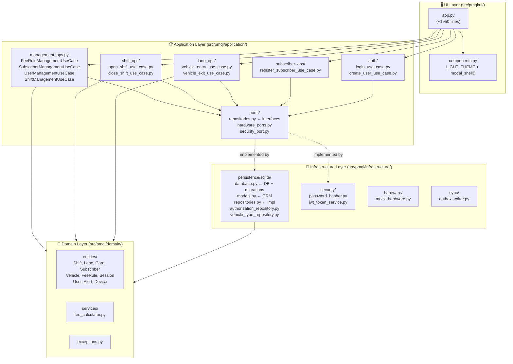

# Architecture Diagram — PMQL Bãi Xe

## Full System Architecture



---

## Feature → Files Cross-Reference

```
┌─────────────────────┬──────────────────────────────────────────────────────────────────┐
│ Tính năng           │ Files liên quan                                                  │
├─────────────────────┼──────────────────────────────────────────────────────────────────┤
│ Dashboard/Overview  │ app.py: overview_page, refresh_live, _active_sessions            │
├─────────────────────┼──────────────────────────────────────────────────────────────────┤
│ Vận hành làn        │ app.py: operations_page, _do_entry, _do_exit                     │
│                     │ lane_ops/vehicle_entry_use_case.py                               │
│                     │ lane_ops/vehicle_exit_use_case.py                                │
│                     │ domain/entities/session.py                                       │
│                     │ domain/services/fee_calculator.py                                │
├─────────────────────┼──────────────────────────────────────────────────────────────────┤
│ Ca làm việc         │ app.py: shift_page, add_shift, open_shift, close_shift_dialog    │
│                     │ shift_ops/open_shift_use_case.py                                 │
│                     │ shift_ops/close_shift_use_case.py                                │
│                     │ management_ops.py: ShiftManagementUseCase                        │
│                     │ domain/entities/shift.py                                         │
├─────────────────────┼──────────────────────────────────────────────────────────────────┤
│ Thuê bao            │ app.py: subscriber_page, load_subscribers, subscriber_dialog     │
│                     │ subscriber_ops/register_subscriber_use_case.py                   │
│                     │ management_ops.py: SubscriberManagementUseCase                   │
│                     │ domain/entities/subscriber.py, vehicle.py                        │
│                     │ infrastructure/persistence/.../repositories.py: SQLiteVehicleRepo│
├─────────────────────┼──────────────────────────────────────────────────────────────────┤
│ Thẻ RFID            │ app.py: card_page, load_cards, card_dialog                       │
│                     │ domain/entities/card.py                                          │
│                     │ infrastructure/persistence/.../repositories.py: SQLiteCardRepo   │
├─────────────────────┼──────────────────────────────────────────────────────────────────┤
│ Biểu phí            │ app.py: fee_page, add_fee_rule, edit_fee_rule, toggle_fee_rule   │
│                     │ management_ops.py: FeeRuleManagementUseCase                      │
│                     │ domain/entities/fee_rule.py                                      │
│                     │ domain/services/fee_calculator.py                                │
├─────────────────────┼──────────────────────────────────────────────────────────────────┤
│ Cấu hình làn        │ app.py: lane_page, load_lanes, show_lane_modal                   │
│                     │ domain/entities/lane.py                                          │
│                     │ infrastructure/persistence/.../repositories.py: SQLiteLaneRepo   │
├─────────────────────┼──────────────────────────────────────────────────────────────────┤
│ Tài khoản           │ app.py: accounts_page, load_accounts                             │
│                     │ auth/create_user_use_case.py, login_use_case.py                  │
│                     │ management_ops.py: UserManagementUseCase                         │
│                     │ domain/entities/user.py                                          │
│                     │ infrastructure/security/password_hasher.py                       │
├─────────────────────┼──────────────────────────────────────────────────────────────────┤
│ Thêm entity mới     │ Xem: .agents/maps/guide_new_entity.md                            │
└─────────────────────┴──────────────────────────────────────────────────────────────────┘
```

---

## Database Schema (SQLite — models.py)

```
lanes          : id, branch_id, name, direction, camera_source, rfid_device_id, barrier_device_id, is_active, is_deleted
vehicles       : id, branch_id, plate_number, vehicle_type, rfid_tag, subscriber_id
subscribers    : id, branch_id, full_name, phone, email, identity_card*, vehicle_type, valid_from, valid_until, is_active, is_deleted
cards          : id, branch_id, rfid_code, card_type*, subscriber_id, vehicle_id, is_active, status*
fee_rules      : id, branch_id, name, vehicle_type, block_minutes, price_per_block, free_minutes, day_max, night_surcharge, is_active, is_deleted
shifts         : id, branch_id, operator_id, lane_id*, note*, opening_cash*, closing_cash*, close_note*, start_time, end_time, total_sessions, total_revenue, status
parking_sessions: id, branch_id, lane_id, shift_id, plate_number, vehicle_type, rfid_tag, entry_time, exit_time, fee, status
users          : id, branch_id, username, password_hash, full_name, role, is_active, is_deleted
alerts         : id, branch_id, alert_type, severity, message, created_at, acknowledged_at, status
vehicle_types  : id, code, name, ...  ← dùng _vehicle_name_map() để lấy {code: name}

* = column được thêm qua migration inline trong database.py
```

---

## UI Component Map (trong app.py / launch())

```
launch()
├── icon_btn()         # Helper tạo nút có icon (dùng qtawesome)
├── label()            # Helper tạo QLabel với style
├── _BTN_EDIT_STYLE    # Style nút xanh
├── _BTN_DEL_STYLE     # Style nút đỏ
├── _BTN_PLAIN_STYLE   # Style nút xám
│
├── class Login        # Màn hình đăng nhập
│
└── class Main         # Cửa sổ chính
    ├── build_sidebar()       # Nav buttons trái
    ├── build_header()        # Header bar trên
    ├── make_table()          # Factory tạo QTableWidget chuẩn
    ├── go(key)               # Navigate đến page
    ├── reload_page(key)      # Recreate page sau CRUD
    ├── refresh_live()        # Cập nhật dashboard live
    │
    ├── overview_page()
    ├── operations_page()
    ├── shift_page()          → add_shift(), open_shift(), close_shift_dialog()
    ├── subscriber_page()     → load_subscribers(), subscriber_dialog()
    ├── card_page()           → load_cards(), card_dialog()
    ├── fee_page()            → add_fee_rule(), edit_fee_rule(), toggle_fee_rule()
    ├── lane_page()           → load_lanes(), show_lane_modal()
    ├── accounts_page()       → load_accounts()
    ├── vehicle_type_page()
    ├── fee_page()
    └── table_page()          # Generic table page (sessions, alerts)

# Async helpers (sau class Main, vẫn trong launch()):
_lanes(), _fee_rules(), _vehicle_name_map()
_subscriber_entities(), _subscriber_with_vehicles()
_card_entities(), _card_display_rows()
_shift_entities(), _user_entities()
_active_sessions(), _session_count_today()
_create_xxx(), _update_xxx(), _delete_xxx()
_open_shift(), _close_shift()
```
